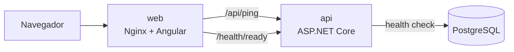

# M0 — Setup do projeto

[← Diário](README.md)

**Objetivo do marco:** um "hello world" ponta a ponta. O navegador abre o Angular, o Angular chama a API, e a API consulta o banco. Tudo sobe com um comando e é verificado pelo CI.



---

## 1. Arquivos da raiz

| Arquivo | Para que serve |
|---------|----------------|
| `.gitignore` | O que o Git ignora: builds (`bin/`, `obj/`, `node_modules/`) e segredos (`.env`) |
| `.gitattributes` | Normaliza quebras de linha para LF. Windows usa CRLF, Linux usa LF; sem isso, scripts quebram dentro do container e todo arquivo aparece como "modificado" |
| `.editorconfig` | Indentação, encoding e estilo de código para qualquer editor. O build do .NET também aplica essas regras |
| `.env.example` | Modelo das variáveis de ambiente. O `.env` real nunca vai para o Git |

## 2. Backend (.NET)

### Comandos usados
```bash
dotnet new sln -n FinanceControl                        # cria a solution (.slnx)
dotnet new webapi -n FinanceControl.Api --use-controllers
dotnet new classlib -n FinanceControl.Domain            # (idem Application, Infrastructure)
dotnet new xunit -n FinanceControl.UnitTests
dotnet sln add <projeto>                                # adiciona à solution
dotnet add <projeto> reference <outro>                  # referência entre projetos
dotnet add <projeto> package <pacote>                   # pacote NuGet
```

### Conceitos
- **Solution e projetos:** cada projeto (`.csproj`) vira uma DLL. As **referências** entre eles impõem a arquitetura: como o Domain não referencia nada, o compilador impede que ele use o EF Core ([ADR-001](../trd/adr/001-arquitetura-em-camadas.md)).
- **`Directory.Build.props`:** configuração compartilhada por todos os projetos (versão do .NET, `Nullable`, `TreatWarningsAsErrors`).
- **`Directory.Packages.props`:** *Central Package Management*, com todas as versões de pacotes num lugar só.
- **`Program.cs`** tem duas partes:
  1. **Serviços** (`builder.Services.Add...`): registra classes no contêiner de **injeção de dependência**. Quando o `PingController` pede um `TimeProvider` no construtor, o ASP.NET entrega a instância registrada.
  2. **Middlewares** (`app.Use...` / `app.Map...`): a esteira por onde cada requisição passa, em ordem.
- **Primary constructors** (C# 12): `class PingController(TimeProvider timeProvider)` declara o construtor direto na classe.
- **`TimeProvider`:** em vez de `DateTime.Now`, o código pede "que horas são" a um serviço. Nos testes, dá para trocar por um relógio fixo. Ele cumpre o papel do `IClock` previsto no TRD, mas já vem no .NET.
- **Health checks:** `/health/live` diz se o processo está de pé; `/health/ready` também testa o banco. Provedores de nuvem usam isso para saber se o container está saudável.
- **Falhar cedo:** sem connection string, a API nem sobe e mostra uma mensagem clara, em vez de quebrar na primeira consulta.

### Testes
- **Integração** (`PingEndpointTests`): o `WebApplicationFactory` sobe a API inteira **em memória** e faz requisições HTTP reais contra ela.
- **Arquitetura** (`LayerDependencyTests`): verifica por reflexão que o Domain não referencia as outras camadas. Ainda passa "fácil", porque o Domain está vazio; começa a proteger de verdade no M1.
- Padrão **Arrange / Act / Assert** e nomes `Metodo_Cenario_Resultado`.

> 💡 **Nota sobre FluentAssertions:** o TRD cita essa biblioteca, mas a versão 8 passou a ter licença paga para uso comercial. Por enquanto usamos o `Assert` do próprio xUnit, que é suficiente. Decidir no M1 se vale adotar uma alternativa (ex.: Shouldly).

## 3. Frontend (Angular)

### Comandos usados
```bash
npx @angular/cli@latest new frontend --style=scss --ssr=false --skip-git
npx ng add angular-eslint      # linter
npx ng test --watch=false      # testes (Vitest)
npx ng build                   # build de produção em dist/
```

### Conceitos
- **Standalone components:** cada componente declara o que usa em `imports: [...]`, sem `NgModule`.
- **Signals:** `signal(valor)` cria um valor reativo; `.set()` muda o valor; no template, lê-se chamando como função: `api()`. O Angular atualiza só o que depende daquele signal.
- **Zoneless:** o Angular 22 não usa mais `zone.js`; os signals avisam o framework sobre mudanças.
- **`inject()`:** pega um serviço do contêiner de DI (equivale ao construtor do C#).
- **`HttpClient` + Observables:** `http.get()` devolve um `Observable`, que só faz a requisição quando alguém chama `.subscribe()`.
- **Control flow:** `@if (...) { }` no template, no lugar do antigo `*ngIf`.
- **`proxy.conf.json`:** em desenvolvimento, o `ng serve` (porta 4200) repassa `/api` para a API (porta 5000). O navegador acha que é tudo uma origem só, exatamente como o Nginx faz em produção ([ADR-010](../trd/adr/010-mesmo-dominio-via-proxy.md)).

### Testes
- **Vitest + jsdom:** roda no Node simulando um navegador, rápido e sem abrir o Chrome.
- **`HttpTestingController`:** intercepta as chamadas HTTP; o teste decide a resposta (`flush`) ou simula erro de rede (`error`). `http.verify()` garante que nenhuma chamada inesperada ficou pendente.

## 4. Docker

- **Imagem** = receita (Dockerfile) empacotada. **Container** = imagem em execução.
- **Multi-stage build:** um estágio grande compila (SDK/Node) e um estágio pequeno só executa (runtime/Nginx). A imagem final não leva compilador nem código-fonte.
- **Cache de camadas:** copiar primeiro só o `.csproj` / `package.json` e restaurar dependências faz o Docker reaproveitar essa etapa quando só o código muda.
- **`USER $APP_UID`:** a API roda sem privilégios de root dentro do container.
- **docker-compose:** os containers se enxergam pelo nome do serviço (`http://api:8080`, `Host=db`). `depends_on` com `service_healthy` faz a API esperar o Postgres ficar pronto.
- **Nginx:**
  - `proxy_pass` repassa `/api`, `/health`, `/swagger` para a API;
  - `try_files ... /index.html` faz rotas como `/dashboard` funcionarem (o Angular resolve no navegador);
  - templates em `/etc/nginx/templates` recebem variáveis de ambiente (`${API_UPSTREAM}`) ao iniciar.
  - ⚠️ **Pegadinha:** um `location` com `add_header` próprio **não herda** os `add_header` do `server`. Por isso os headers de segurança estão num arquivo incluído em cada `location`.

## 5. CI (GitHub Actions)

`.github/workflows/ci.yml` roda em todo push na `main` e em todo PR, com três jobs em paralelo:

| Job | Faz |
|-----|-----|
| Backend | restore → build (Release) → testes |
| Frontend | `npm ci` → lint → testes → build de produção |
| Docker | `docker compose build` (garante que as imagens buildam) |

- `npm ci` (e não `npm install`) instala **exatamente** o que está no `package-lock.json`.
- `concurrency` cancela execuções antigas do mesmo PR.
- `permissions: contents: read`: o workflow só pode ler o repositório (menor privilégio).

---

## 🏋️ Exercícios sugeridos

1. **Novo endpoint:** crie `GET /api/ping/echo?text=oi` que devolve o texto recebido. Escreva o teste de integração antes de implementar e veja-o falhar e depois passar (é o ciclo do TDD).
2. **Quebre o CI de propósito:** numa branch, adicione uma variável não usada no C# (`var x = 1;`) e abra um PR. O `TreatWarningsAsErrors` deve derrubar o build. Depois apague a branch.
3. **Banco fora do ar:** com `docker compose up`, rode `docker compose stop db` e clique em "Verificar novamente" na página. O status do banco deve ficar vermelho. Volte com `docker compose start db`.
4. **Explore o Swagger:** abra http://localhost:8080/swagger e execute o `GET /api/ping` por lá.
5. **Leia o SQL:** em modo dev, os logs mostram os comandos SQL do EF Core. Rode `/health/ready` e encontre a consulta que o health check fez.
