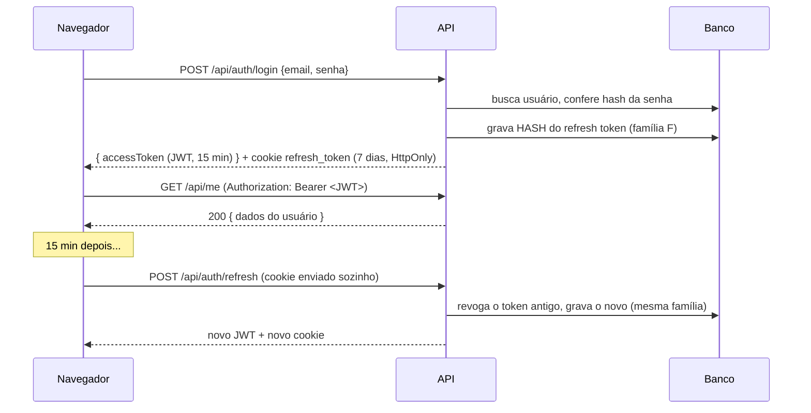

# M1a — Autenticação (backend)

[← Diário](README.md) · **Requisito:** [RF-01](../prd/modulos/01-autenticacao.md) · **Especificação:** [TRD módulo 1](../trd/modulos/01-autenticacao.md) · **Segurança:** [TRD 04](../trd/04-seguranca.md)

**Objetivo do marco:** cadastro, login, sessão que se renova sozinha e logout, com as proteções certas e testadas contra um banco real. O frontend vem no M1b.

---

## 1. O fluxo completo



## 2. Conceitos

### Autenticação × Autorização
- **Autenticação** responde "quem é você?". É o `UseAuthentication()`, que lê e valida o JWT.
- **Autorização** responde "você pode fazer isto?". É o `UseAuthorization()`, que aplica as políticas.
- **Fallback policy:** configuramos que **toda** rota exige login, e as públicas precisam de `[AllowAnonymous]`. Esquecer de proteger uma rota nova deixa de ser possível. É o princípio *secure by default*.

### JWT (JSON Web Token)
- Tem três partes separadas por ponto: `cabeçalho.conteúdo.assinatura`, cada uma em Base64Url.
- **Qualquer um pode ler o conteúdo**; ele não é criptografado. Por isso só guardamos id, nome e e-mail, nunca nada sensível.
- A **assinatura** (HMAC-SHA256 com a `Jwt:Key`) garante que ninguém **alterou** o token. Mudou um caractere, a assinatura não bate e a API responde 401.
- É *stateless*: a API valida o JWT sem consultar o banco, e por isso ele dura pouco (15 min).

> 🔎 **Experimente:** copie um `accessToken` do Swagger e cole em [jwt.io](https://jwt.io). Você verá `sub`, `email`, `name`, `exp`... (é seguro aqui, porque são tokens do seu ambiente local).

### Refresh token, rotação e detecção de reuso
- O refresh token é **aleatório** (64 bytes) e não carrega informação nenhuma. No banco vai só o **hash SHA-256**: se o banco vazar, os tokens não servem para nada.
- **Rotação:** cada uso troca o token por um novo, e o antigo é revogado.
- **Detecção de reuso:** se um token **já trocado** aparecer de novo, alguém o copiou. A API revoga a **família** inteira (todos os tokens daquele login), e o atacante e o usuário são deslogados. O usuário faz login de novo; o atacante não tem a senha.

### Cookie `HttpOnly` + `SameSite=Strict` + `Path` ([ADR-005](../trd/adr/005-armazenamento-de-tokens.md))
| Atributo | Protege contra |
|----------|----------------|
| `HttpOnly` | JavaScript não lê o cookie, então um XSS não rouba o refresh token |
| `Secure` | só trafega por HTTPS (`localhost` é considerado seguro pelos navegadores) |
| `SameSite=Strict` | não é enviado quando a requisição vem de outro site (CSRF) |
| `Path=/api/auth` | só vai para as rotas de autenticação, não para todas as chamadas |

O header `X-Requested-With` obrigatório no refresh e no logout é a "segunda tranca" contra CSRF: um formulário malicioso de outro site não consegue enviar headers customizados.

### ASP.NET Core Identity ([ADR-004](../trd/adr/004-identity-e-jwt.md))
- `UserManager<AppUser>` cria usuários, confere senhas (`CheckPasswordAsync`) e controla o bloqueio (`AccessFailedAsync`, `IsLockedOutAsync`).
- A senha vira **hash PBKDF2 com salt**: nem nós conseguimos ver a senha original.
- **Mensagem genérica** ("E-mail ou senha inválidos") para e-mail inexistente, senha errada e conta bloqueada: um atacante não descobre quem está cadastrado.

### Camadas na prática
- `IAuthService` (contrato) fica na **Application**; `AuthService` (implementação) fica na **Infrastructure**, porque depende do Identity.
- A entidade `RefreshToken` fica no **Domain**, com as regras dentro dela (`IsActive`, `Revoke`). Isso é um *modelo de domínio rico*.
- O mapeamento para o banco (`RefreshTokenConfiguration`) fica na Infrastructure, para o Domain continuar sem depender do EF Core. O teste de arquitetura agora protege isso de verdade.

### Tratamento de erros centralizado
- Services lançam exceções de negócio (`ConflictException`, `UnauthorizedException`...).
- O `GlobalExceptionHandler` converte cada uma no status HTTP certo, no formato **ProblemDetails**, com `traceId`.
- Controllers ficam sem `try/catch`. Única exceção: o `Refresh`, porque o middleware de erro **limpa os headers** da resposta e apagaria o `Set-Cookie` que remove o cookie inválido.

### Options pattern
- A seção `"Jwt"` do appsettings vira a classe `JwtOptions`, com validação (`[Required]`, chave ≥ 32 bytes).
- `ValidateOnStart()`: com configuração errada a API **nem sobe**, e a mensagem diz exatamente o que falta.

### EF Core Migrations
```bash
dotnet tool restore     # instala o dotnet-ef na versão do dotnet-tools.json
dotnet ef migrations add NomeDaMudanca \
  --project src/FinanceControl.Infrastructure \
  --startup-project src/FinanceControl.Infrastructure \
  --output-dir Persistence/Migrations
```
- A migration é **código versionado**: o banco de qualquer ambiente é recriado aplicando as migrations em ordem.
- `AppDbContextFactory` permite gerar migrations sem subir a API inteira.
- Em dev e no Docker, a API aplica as migrations ao subir (`Database:MigrateOnStartup`).
- Código gerado foi marcado como `generated_code` no `.editorconfig`, para as regras de estilo não reclamarem dele.

### Rate limiting
`[EnableRateLimiting("auth")]`: no máximo 10 requisições por minuto, por IP, nas rotas de login. Passou disso, a resposta é `429 Too Many Requests`. Funciona em conjunto com o bloqueio de conta do Identity.

## 3. Testes

| Tipo | Quantidade | Destaques |
|------|-----------|-----------|
| Unitários | 23 | Regras do `RefreshToken`, validators, arquitetura |
| Integração | 21 | Cadastro, login, bloqueio após 5 erros, token expirado, token forjado, rotação, **reuso revoga a família**, logout, CSRF |

- **Testcontainers** sobe um `postgres:18-alpine` real para os testes e o destrói no final. É preciso ter o Docker rodando.
- `ApiFactory` + `[Collection("Api")]`: um único container compartilhado por todas as classes de teste, o que é mais rápido.
- Cada teste cria seus próprios dados (e-mails únicos), então os testes não interferem uns nos outros.
- O teste de "token forjado" assina um JWT com **outra chave**, e a API recusa. É isso que a assinatura garante.

---

## 🏋️ Exercícios sugeridos

1. **Swagger com autenticação:** suba com `docker compose up --build`, abra http://localhost:8080/swagger, faça `POST /api/auth/register`, copie o `accessToken`, clique em **Authorize** e chame `GET /api/me`.
2. **Decodifique o JWT** em jwt.io e encontre o `exp`. Converta o número (segundos desde 1970) para data e confira que são 15 minutos depois do `iat`.
3. **Veja o hash no banco:**
   ```bash
   docker compose exec db psql -U finance -d finance -c "select token_hash, revoked_at, family_id from refresh_tokens order by created_at desc limit 5;"
   ```
   O valor no cookie é diferente do `token_hash`. Por quê?
4. **Provoque o bloqueio:** erre a senha 5 vezes e tente com a senha certa. Depois olhe `lockout_end` na tabela `users`.
5. **TDD:** escreva um teste de integração para "cadastro com nome de 1 letra retorna 400 com erro em `name`" (o validator já trata; o teste ainda não existe).
6. **Desafio:** o que aconteceria se o frontend chamasse `/refresh` duas vezes ao mesmo tempo com o mesmo cookie? (Dica: releia "detecção de reuso". O M1b resolve isso no interceptor.)
