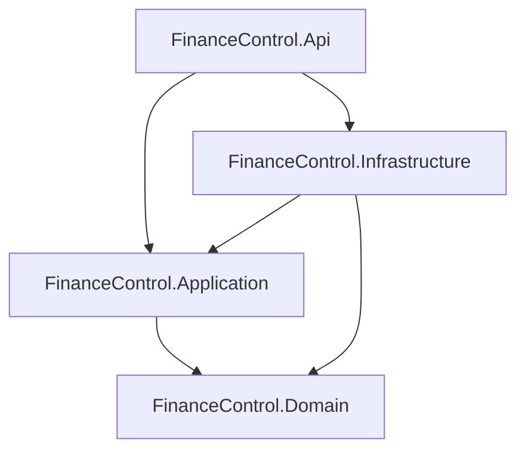
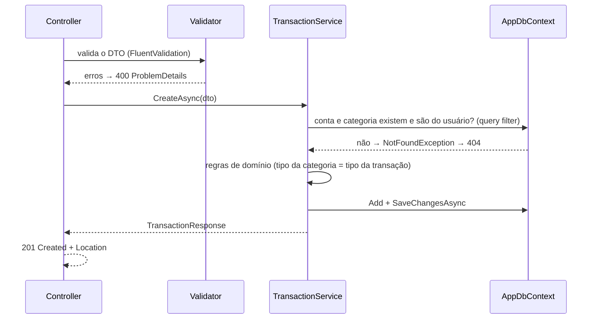

# 1. Arquitetura do backend

[← TRD](README.md) · Decisão base: [ADR-001](adr/001-arquitetura-em-camadas.md)

## Projetos e dependências



| Projeto | Responsabilidade | Pode depender de |
|---------|------------------|------------------|
| **Domain** | Entidades, enums, regras de negócio puras (ex.: validar uma transferência). Nada de EF Core, ASP.NET ou bibliotecas externas. | nada |
| **Application** | Services por feature, DTOs de entrada e saída, validators (FluentValidation), interfaces (`IAppDbContext`, `ICurrentUser`, `ITokenService`), exceções de negócio. | Domain, EF Core (abstrações) |
| **Infrastructure** | `AppDbContext`, configurações do EF (`IEntityTypeConfiguration`), migrations, Identity, emissão de tokens, Hangfire, seeds. | Application, Domain |
| **Api** | `Program.cs`, controllers, middlewares, handler de exceções, configuração de Swagger, Serilog, autenticação e health checks. | Application, Infrastructure (só para registrar DI) |

## Estrutura de pastas

```
backend/
├── FinanceControl.slnx          # solution no formato XML do .NET 10
├── Directory.Build.props        # TargetFramework, Nullable, TreatWarningsAsErrors
├── Directory.Packages.props     # versões centralizadas de pacotes NuGet
├── src/
│   ├── FinanceControl.Domain/
│   │   ├── Entities/            # Account, Category, Transaction, RefreshToken
│   │   └── Enums/               # AccountType, CategoryType, TransactionType
│   ├── FinanceControl.Application/
│   │   ├── Abstractions/        # IAppDbContext, ICurrentUser, ITokenService
│   │   ├── Common/              # PagedResult<T>, exceções (NotFoundException, ConflictException…)
│   │   └── Features/
│   │       ├── Auth/            # IAuthService, DTOs, validators (implementação na Infrastructure)
│   │       ├── Accounts/
│   │       ├── Categories/
│   │       ├── Transactions/
│   │       └── Dashboard/
│   ├── FinanceControl.Infrastructure/
│   │   ├── Persistence/         # AppDbContext, Configurations/, Migrations/, Seeds/
│   │   ├── Identity/            # AppUser, AuthService, JwtTokenGenerator
│   │   └── Jobs/                # jobs do Hangfire
│   └── FinanceControl.Api/
│       ├── Controllers/
│       ├── Infrastructure/      # GlobalExceptionHandler, CurrentUser, extensões de DI
│       └── Program.cs
└── tests/
    ├── FinanceControl.UnitTests/
    └── FinanceControl.IntegrationTests/
```

> Organização **por feature** dentro de Application: tudo de "Transações" fica junto, em vez de pastas `Services/`, `Dtos/` e `Validators/` gigantes.

## Fluxo de uma requisição

Exemplo: `POST /api/transactions`.



**Regras:**
- Controllers são finos: recebem, validam, chamam o service e devolvem o status HTTP. Sem regra de negócio.
- Services recebem e devolvem **DTOs**, nunca entidades do EF.
- O `UserId` vem **sempre** de `ICurrentUser` (lido do token), **nunca** do corpo da requisição.
- Consultas de leitura usam `AsNoTracking()` e projeção (`Select`) direto para o DTO.

## Tratamento de erros

Exceções de negócio definidas na Application e convertidas por um `IExceptionHandler` global na Api:

| Exceção | Status | Quando |
|---------|--------|--------|
| `ValidationException` (FluentValidation) | 400 | Entrada inválida |
| `NotFoundException` | 404 | Recurso não existe **ou pertence a outro usuário** |
| `ConflictException` | 409 | E-mail já cadastrado; excluir conta com transações |
| `BusinessRuleException` | 422 | Regra de negócio violada (ex.: categoria de despesa em receita) |
| qualquer outra | 500 | Erro inesperado: loga o detalhe, devolve mensagem genérica |

Formato da resposta em [03-api.md](03-api.md#erros).

## Injeção de dependência

Cada camada expõe um método de extensão para registrar seus serviços, chamado no `Program.cs`:

```csharp
builder.Services
    .AddApplication()                          // services e validators
    .AddInfrastructure(builder.Configuration)  // DbContext, Identity, tokens, Hangfire
    .AddApi();                                 // controllers, auth, Swagger, ProblemDetails
```

## Relógio

"Que horas são" vem do `TimeProvider` do próprio .NET (registrado como `TimeProvider.System`), nunca de `DateTime.Now`. Nos testes, ele é trocado por um relógio fixo. Ele substitui o `IClock` previsto na primeira versão do TRD: mesma função, sem código próprio.

## Configuração

Lida com o padrão `IOptions<T>` e validada na inicialização (`ValidateOnStart`), para a API não subir com configuração errada. Detalhes das variáveis em [06-infra-e-deploy.md](06-infra-e-deploy.md#configuração).
