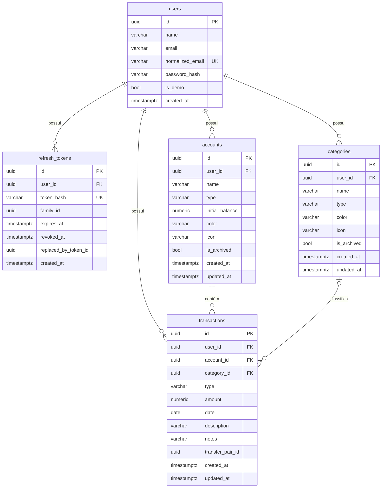

# 2. Modelo de dados

[← TRD](README.md) · Decisões: [ADR-002](adr/002-postgresql.md), [ADR-006](adr/006-saldo-calculado.md), [ADR-007](adr/007-transferencia-dois-registros.md), [ADR-012](adr/012-dinheiro-e-datas.md)

## Convenções

- Tabelas e colunas em `snake_case`, tabelas no plural (`EFCore.NamingConventions`).
- Chaves primárias `uuid`, geradas na aplicação com **UUID v7** (`Guid.CreateVersion7()`): ordenáveis por tempo, o que é melhor para índices do que UUID aleatório.
- Enums gravados como **texto** (`HasConversion<string>()`): o banco fica legível e reordenar o enum no C# não corrompe dados.
- Toda tabela de dados do usuário tem `user_id` e um **query filter global** por usuário ([04-seguranca.md](04-seguranca.md#isolamento-entre-usuários)).
- `created_at` / `updated_at` preenchidos automaticamente no `SaveChangesAsync`.
- Chaves estrangeiras com `ON DELETE RESTRICT`, exceto onde indicado. Nada é apagado em cascata por acidente.

## Diagrama ER (MVP)



## Tabelas

### `users`
Gerenciada pelo ASP.NET Core Identity ([ADR-004](adr/004-identity-e-jwt.md)); a tabela `AspNetUsers` é renomeada para `users`. Além dos campos do Identity (`security_stamp`, `lockout_end`, `access_failed_count`…), adiciona:

| Coluna | Tipo | Regras |
|--------|------|--------|
| `name` | `varchar(100)` | obrigatório |
| `is_demo` | `boolean` | padrão `false`; usuário demo não pode trocar senha nem ser excluído |
| `created_at` | `timestamptz` | |

### `refresh_tokens`
| Coluna | Tipo | Regras |
|--------|------|--------|
| `id` | `uuid` | PK |
| `user_id` | `uuid` | FK → `users`, `ON DELETE CASCADE` |
| `token_hash` | `varchar(64)` | SHA-256 do token em hexadecimal; **único**. O token puro nunca é gravado |
| `family_id` | `uuid` | mesma "família" em todas as rotações de um login; usada para revogar tudo em caso de reuso |
| `expires_at` | `timestamptz` | |
| `revoked_at` | `timestamptz?` | preenchido no logout, na rotação ou na detecção de reuso |
| `replaced_by_token_id` | `uuid?` | token que substituiu este na rotação |
| `created_at` | `timestamptz` | |

Índices: `token_hash` (único), `(user_id)`, `(family_id)`.

### `accounts`
| Coluna | Tipo | Regras |
|--------|------|--------|
| `name` | `varchar(60)` | obrigatório |
| `type` | `varchar(20)` | `Checking`, `Savings`, `Cash`, `CreditCard`, `Other` |
| `initial_balance` | `numeric(18,2)` | pode ser negativo (cartão de crédito) |
| `color` | `varchar(7)` | hexadecimal `#RRGGBB` |
| `icon` | `varchar(40)` | nome de um ícone do Material Symbols |
| `is_archived` | `boolean` | padrão `false` |

Índices: `(user_id)`; **único** `(user_id, lower(name))` para não haver duas contas com o mesmo nome.

### `categories`
| Coluna | Tipo | Regras |
|--------|------|--------|
| `name` | `varchar(40)` | obrigatório |
| `type` | `varchar(10)` | `Income` ou `Expense` |
| `color`, `icon`, `is_archived` | | iguais a `accounts` |

Índices: **único** `(user_id, type, lower(name))`.

### `transactions`
| Coluna | Tipo | Regras |
|--------|------|--------|
| `account_id` | `uuid` | FK → `accounts` |
| `category_id` | `uuid?` | FK → `categories`; nulo **somente** em transferências |
| `type` | `varchar(12)` | `Income`, `Expense`, `TransferIn`, `TransferOut` |
| `amount` | `numeric(18,2)` | `CHECK (amount > 0)` |
| `date` | `date` | data de competência |
| `description` | `varchar(200)` | obrigatório |
| `notes` | `varchar(1000)?` | |
| `transfer_pair_id` | `uuid?` | preenchido **somente** em transferências |

**Constraints de consistência:**
```sql
CHECK (
  (type IN ('Income', 'Expense')         AND category_id IS NOT NULL AND transfer_pair_id IS NULL)
  OR
  (type IN ('TransferIn', 'TransferOut') AND category_id IS NULL     AND transfer_pair_id IS NOT NULL)
)
```

**Índices:**
| Índice | Para quê |
|--------|----------|
| `(user_id, date DESC)` | listagem padrão e dashboard por período |
| `(account_id)` | cálculo de saldo ([ADR-006](adr/006-saldo-calculado.md)) |
| `(category_id)` | filtro e gráfico por categoria |
| `(transfer_pair_id)` | achar o outro lado da transferência |

> A regra "o tipo da categoria precisa bater com o tipo da transação" é validada no service, porque envolve outra tabela.

## Seeds

| Seed | Quando roda | Conteúdo |
|------|-------------|----------|
| Categorias padrão | No cadastro de cada usuário (copiadas para ele) | Despesas: Alimentação, Moradia, Transporte, Saúde, Lazer, Educação, Compras, Assinaturas, Outros. Receitas: Salário, Freelance, Rendimentos, Outros |
| Usuário demo | Na inicialização (se `Demo:Enabled`) e no reset diário | Ver [modulos/06-usuario-demo.md](modulos/06-usuario-demo.md) |

As categorias padrão são **copiadas** para cada usuário (e não compartilhadas), para que ele possa renomear e arquivar livremente.

## Migrations

- Criadas com `dotnet ef migrations add <Nome>` no projeto Infrastructure, versionadas no Git.
- Aplicadas automaticamente na inicialização quando `Database:MigrateOnStartup=true` (padrão em dev e demo). Em um ambiente "de verdade" o certo seria aplicar no pipeline de deploy; a escolha aqui é por simplicidade, e está documentada.
- Nunca editar uma migration já aplicada no ambiente de demo; criar uma nova.

## Tabelas das fases futuras (preliminar)

`imports`, `category_rules`, `budgets`, `recurring_transactions` e a coluna `transactions.external_id`. Ver [modulos/fases-2-e-3.md](modulos/fases-2-e-3.md).
