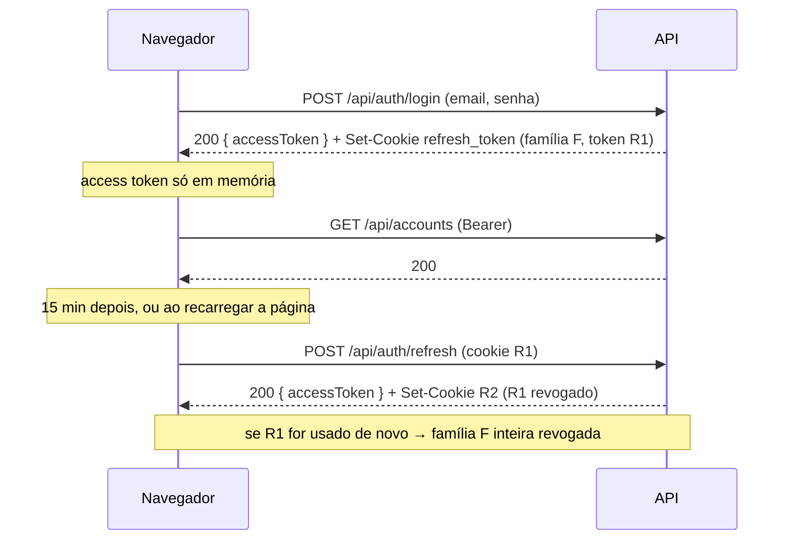

# 4. Segurança

[← TRD](README.md) · Decisões: [ADR-004](adr/004-identity-e-jwt.md), [ADR-005](adr/005-armazenamento-de-tokens.md), [ADR-010](adr/010-mesmo-dominio-via-proxy.md)

## Autenticação

### Senhas
- Hash feito pelo ASP.NET Core Identity (PBKDF2 com salt).
- Regras: mínimo 8 caracteres, pelo menos uma letra e um número. Sem exigência de símbolo ou maiúscula (regras exageradas pioram senhas na prática).
- **Lockout:** 5 tentativas erradas bloqueiam o login por 15 minutos.
- Mensagem de login inválido sempre genérica ("E-mail ou senha inválidos"), para não revelar se o e-mail existe.

### Access token (JWT)
| Item | Valor |
|------|-------|
| Algoritmo | HS256 (chave simétrica; há um único emissor e um único consumidor) |
| Validade | 15 minutos |
| Claims | `sub` (id do usuário), `email`, `name`, `jti`, `iat`, `exp` |
| `iss` / `aud` | configuráveis; validados pela API |
| Chave | `Jwt__Key`, ≥ 32 bytes aleatórios, vinda de variável de ambiente |
| Clock skew | 30 segundos |

### Refresh token
| Item | Valor |
|------|-------|
| Formato | 64 bytes aleatórios (`RandomNumberGenerator`), em Base64Url |
| Armazenamento no banco | só o **hash SHA-256** (`refresh_tokens.token_hash`) |
| Validade | 7 dias |
| Transporte | cookie `refresh_token`: `HttpOnly; Secure; SameSite=Strict; Path=/api/auth` |
| Rotação | a cada `/refresh`, o token usado é revogado e um novo é emitido na mesma família |
| Reuso | se um token **já revogado** for apresentado, todos os tokens da família são revogados (indício de roubo) e o usuário precisa logar de novo |
| Logout | revoga o token atual e apaga o cookie |



Tokens expirados e revogados há mais de 30 dias são apagados por um job diário do Hangfire.

## Isolamento entre usuários

Requisito crítico do PRD (RNF-02). Três camadas de proteção:

1. **Query filter global:** toda entidade com `UserId` recebe no `AppDbContext`
   ```csharp
   builder.HasQueryFilter(e => e.UserId == _currentUser.UserId);
   ```
   Qualquer consulta, inclusive de outra conta ou categoria, só enxerga dados do usuário logado.
2. **Gravação:** o `UserId` é atribuído pelo service a partir do `ICurrentUser`. Os DTOs de entrada **não têm** campo `userId`.
3. **Referências cruzadas:** ao criar uma transação, o service busca a conta e a categoria pelo id. Como o filtro está ativo, o id de outro usuário retorna `null` → `404`.

**Teste obrigatório:** um teste de integração cria dois usuários e verifica que cada endpoint de leitura, edição e exclusão do usuário B retorna `404` para os recursos do usuário A ([08-testes.md](08-testes.md)).

> Cuidado: `IgnoreQueryFilters()` só pode aparecer em código de infraestrutura (jobs, seeds), nunca num service chamado por um controller.

## Proteções da API

| Ameaça | Proteção |
|--------|----------|
| Força bruta no login | Lockout do Identity + **rate limiting** nativo do ASP.NET Core em `/api/auth/*` (ex.: 10 req/min por IP) |
| CSRF no refresh | `SameSite=Strict`, cookie restrito a `/api/auth`, mesma origem e header `X-Requested-With` obrigatório ([ADR-005](adr/005-armazenamento-de-tokens.md)) |
| XSS | Angular escapa interpolação por padrão; proibido usar `innerHTML` com dados do usuário e `bypassSecurityTrust*`. Header `Content-Security-Policy` no Nginx |
| Mass assignment | DTOs de entrada específicos por operação; nunca fazer bind direto na entidade |
| SQL injection | EF Core com parâmetros; SQL bruto só via `FromSql` interpolado (parametrizado) |
| Vazamento de detalhes | Em produção, `500` devolve mensagem genérica; stack trace só no log |
| Upload malicioso (Fase 2) | Limite de tamanho, validação de extensão e conteúdo, arquivo nunca salvo em disco público |

## Headers de segurança (Nginx)

```
Strict-Transport-Security: max-age=31536000; includeSubDomains
Content-Security-Policy: default-src 'self'; img-src 'self' data:; style-src 'self' 'unsafe-inline'; font-src 'self' data:
X-Content-Type-Options: nosniff
Referrer-Policy: strict-origin-when-cross-origin
X-Frame-Options: DENY
```

`style-src 'unsafe-inline'` é necessário para o Angular Material. Fontes e ícones são servidos localmente (sem Google Fonts por CDN) para manter a CSP restrita.

## Segredos

- Nada de segredo no repositório. O `appsettings.json` versionado só tem valores não sensíveis.
- Desenvolvimento: `dotnet user-secrets` ou arquivo `.env` (no `.gitignore`), a partir de um `.env.example` versionado.
- Produção: variáveis de ambiente do provedor de hospedagem.
- CI: GitHub Actions Secrets.

## Usuário demo

- Marcado com `is_demo = true`.
- Não pode trocar senha, e-mail nem excluir a conta (`403` com mensagem explicativa, já que aqui o recurso é do próprio usuário).
- Login via `POST /api/auth/demo`, que só existe quando `Demo:Enabled=true`.
