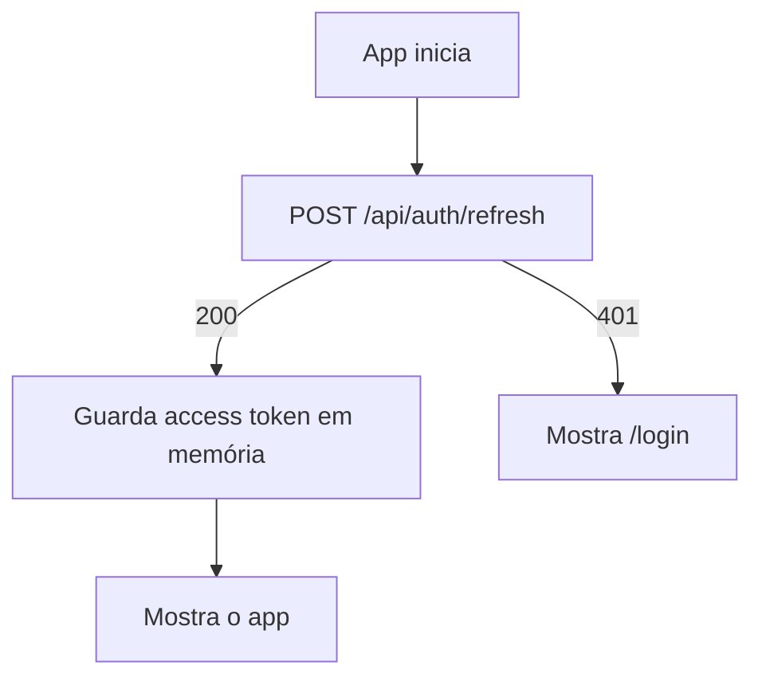

# 5. Frontend (Angular)

[← TRD](README.md) · Decisões: [ADR-003](adr/003-angular-material.md), [ADR-005](adr/005-armazenamento-de-tokens.md), [ADR-011](adr/011-graficos-ng2-charts.md)

## Base

- **Angular** na versão estável mais recente no início do M0 (fixada no `package.json`).
- **Standalone components** (sem `NgModule`), **signals** para estado e **control flow** nativo (`@if`, `@for`).
- **TypeScript strict** e **typed Reactive Forms**.
- **ESLint** (`angular-eslint`) + **Prettier**.

## Estrutura

```
frontend/src/app/
├── app.config.ts            # providers: router, http + interceptors, locale pt-BR, Material
├── app.routes.ts            # rotas raiz com lazy loading por feature
├── core/
│   ├── auth/                # AuthService, authGuard, guestGuard, auth.interceptor
│   ├── http/                # error.interceptor, ApiError (tipo do ProblemDetails)
│   └── layout/              # shell: toolbar, menu lateral, container das páginas
├── shared/
│   ├── components/          # empty-state, confirm-dialog, money, page-header
│   ├── pipes/               # brl (moeda), formatação de datas
│   └── models/              # tipos que espelham os DTOs da API
└── features/
    ├── auth/                # login, register
    ├── dashboard/
    ├── accounts/
    ├── categories/
    └── transactions/
```

Cada feature segue o mesmo padrão:

```
features/transactions/
├── transactions.routes.ts
├── data/transactions.api.ts       # chamadas HTTP (só isso)
├── data/transactions.store.ts     # estado com signals: lista, filtros, loading, erro
├── pages/transaction-list/        # componente "inteligente" ligado à store
└── components/transaction-form/   # componente de apresentação (inputs/outputs)
```

## Estado

- **Sem NgRx.** Cada feature tem uma *store* simples: um service `@Injectable` com `signal`s privados, `computed`s públicos e métodos que chamam a API.
- Filtros da listagem de transações ficam também na **URL** (query params), para o usuário poder recarregar ou compartilhar a tela sem perder o filtro.
- Depois de criar, editar ou excluir, a store recarrega a lista e os dados afetados (ex.: saldos das contas).

> NgRx resolve problemas de apps grandes com muito estado compartilhado. Aqui, signals + services bastam e são o caminho que o próprio Angular recomenda hoje.

## Rotas

| Rota | Página | Guard |
|------|--------|-------|
| `/login`, `/register` | Autenticação | `guestGuard` (logado vai para o dashboard) |
| `/` | redireciona para `/dashboard` | |
| `/dashboard` | Dashboard | `authGuard` |
| `/transactions` | Lista + filtros | `authGuard` |
| `/accounts` | Contas e saldos | `authGuard` |
| `/categories` | Categorias | `authGuard` |
| `**` | Página 404 | |

Todas as features são carregadas com `loadChildren` / `loadComponent` (lazy loading).

## Autenticação no frontend



- **Inicialização:** `provideAppInitializer` chama `AuthService.tryRefresh()` antes da primeira rota ser resolvida.
- **`authInterceptor`:**
  1. adiciona `Authorization: Bearer <token>` nas chamadas para `/api` (exceto `/api/auth/*`);
  2. ao receber `401`, chama `/api/auth/refresh` **uma única vez** (requisições simultâneas esperam o mesmo refresh) e repete a requisição original;
  3. se o refresh falhar, limpa a sessão e redireciona para `/login`.
- **Chamadas de `/api/auth/*`** enviam `withCredentials: true` e o header `X-Requested-With: XMLHttpRequest`.

## Erros e feedback

- **`errorInterceptor`:** converte o ProblemDetails em `ApiError`. Erros `5xx` e de rede mostram um snackbar genérico.
- **Erros `400`:** o formulário mapeia `errors` da resposta para os campos correspondentes (`setErrors`), exibindo as mensagens em português embaixo de cada campo.
- Todas as telas têm três estados tratados: **carregando** (skeleton ou spinner), **vazio** (componente `empty-state` com chamada para ação) e **erro** (mensagem + botão "Tentar de novo").

## Formatação (pt-BR)

- `registerLocaleData(localePt)` e `LOCALE_ID = 'pt-BR'`.
- Moeda: `currency: 'BRL'` → `R$ 1.234,56`. Despesas em vermelho com sinal de menos; receitas em verde.
- Datas: `dd/MM/yyyy`; `mat-datepicker` com `MAT_DATE_LOCALE = 'pt-BR'`.
- Campo de valor aceita vírgula como separador decimal e converte para número antes de enviar.

## Gráficos

`ng2-charts` com dois componentes de apresentação em `features/dashboard/components/`:
- `expenses-by-category-chart` (rosca), usando a cor cadastrada de cada categoria;
- `monthly-evolution-chart` (barras agrupadas receita × despesa).

## Acessibilidade e responsividade

- Componentes do Material já trazem foco e ARIA; formulários sempre com `mat-label`.
- Cores nunca são a única informação (valores negativos também têm sinal de menos).
- Layout: menu lateral vira gaveta (`mat-sidenav` modo `over`) abaixo de 960 px; tabela de transações vira lista de cards abaixo de 600 px. Largura mínima suportada: 360 px.

## Desenvolvimento local

`ng serve` com `proxy.conf.json` apontando `/api`, `/health` e `/hangfire` para `http://localhost:5000`, reproduzindo a mesma origem do Nginx ([ADR-010](adr/010-mesmo-dominio-via-proxy.md)).
