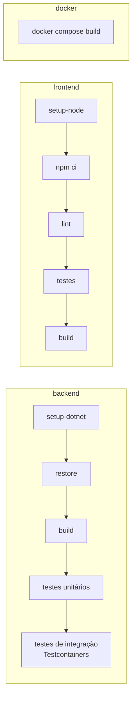

# 6. Infraestrutura e deploy

[← TRD](README.md) · Decisão base: [ADR-010](adr/010-mesmo-dominio-via-proxy.md)

## Estrutura do repositório (monorepo)

```
controle-financeiro/
├── backend/                 # solução .NET (ver 01-arquitetura.md)
│   └── Dockerfile
├── frontend/                # app Angular
│   ├── Dockerfile           # build do Angular + imagem Nginx
│   └── nginx/default.conf.template
├── docs/
│   ├── prd/
│   └── trd/
├── .github/workflows/
├── docker-compose.yml
├── .env.example
├── .gitattributes           # normaliza quebras de linha (LF)
├── .editorconfig
└── README.md
```

## Containers

| Serviço | Imagem | Porta interna | Função |
|---------|--------|---------------|--------|
| `web` | build multi-stage: Node (build) → `nginx:alpine` | 80 | Serve o Angular; proxy de `/api`, `/health`, `/hangfire`, `/swagger` |
| `api` | build multi-stage: `dotnet/sdk` → `dotnet/aspnet` | 8080 | API + jobs do Hangfire; roda como usuário não-root |
| `db` | `postgres` (versão fixada) | 5432 | Banco; volume nomeado para persistir dados |

### `docker-compose.yml` (esboço)

```yaml
services:
  db:
    image: postgres:<versão fixada no M0>
    environment:
      POSTGRES_DB: finance
      POSTGRES_USER: finance
      POSTGRES_PASSWORD: ${POSTGRES_PASSWORD}
    volumes: [db-data:/var/lib/postgresql/data]
    healthcheck:
      test: ["CMD-SHELL", "pg_isready -U finance"]
      interval: 5s

  api:
    build: ./backend
    environment:
      ConnectionStrings__Default: Host=db;Database=finance;Username=finance;Password=${POSTGRES_PASSWORD}
      Jwt__Key: ${JWT_KEY}
      Demo__Enabled: "true"
    depends_on:
      db: { condition: service_healthy }

  web:
    build: ./frontend
    environment:
      API_UPSTREAM: http://api:8080
    ports: ["8080:80"]
    depends_on: [api]

volumes:
  db-data:
```

**Resultado:** `docker compose up` → app em `http://localhost:8080`, Swagger em `http://localhost:8080/swagger`.

## Fluxo de desenvolvimento

| Modo | Como | Quando usar |
|------|------|-------------|
| **Tudo em Docker** | `docker compose up --build` | Testar como em produção; avaliadores rodando o projeto |
| **Dev com hot reload** | `docker compose up db` + `dotnet watch` em `backend/src/FinanceControl.Api` + `ng serve` em `frontend/` | Dia a dia de desenvolvimento |

## Configuração

Variáveis de ambiente (no .NET, `__` separa seções: `Jwt__Key` = `Jwt:Key`):

| Variável | Obrigatória | Exemplo / padrão | Descrição |
|----------|-------------|------------------|-----------|
| `ConnectionStrings__Default` | sim | `Host=db;Database=finance;...` | Conexão com o Postgres |
| `Jwt__Key` | sim | 32+ bytes aleatórios | Chave de assinatura do JWT |
| `Jwt__Issuer` / `Jwt__Audience` | não | `finance-control` | Validados no token |
| `Jwt__AccessTokenMinutes` | não | `15` | |
| `Jwt__RefreshTokenDays` | não | `7` | |
| `Auth__SecureCookies` | não | `true` (`false` só em dev HTTP) | Flag `Secure` do cookie |
| `Database__MigrateOnStartup` | não | `true` | Aplica migrations ao subir |
| `Demo__Enabled` | não | `false` | Habilita usuário demo e `POST /api/auth/demo` |
| `Hangfire__DashboardEnabled` | não | `true` | |
| `Swagger__Enabled` | não | `true` em dev/demo | |
| `API_UPSTREAM` (web) | sim | `http://api:8080` | Para onde o Nginx repassa `/api` |

O `.env.example` traz todas elas com valores de exemplo. A API valida as obrigatórias ao subir e falha com mensagem clara se faltar alguma.

## CI/CD (GitHub Actions)

### `ci.yml`: em todo push e pull request



- Jobs `backend` e `frontend` rodam em paralelo; `docker` valida que as imagens buildam.
- Os runners Ubuntu do GitHub já têm Docker, o que permite os testes com Testcontainers.
- Cache de pacotes NuGet e npm.
- PR só pode ser mergeado com CI verde (branch protection na `main`).

### `cd.yml`: em push na `main` (a partir do M5)

1. Builda as imagens `api` e `web` e publica no **GitHub Container Registry** (`ghcr.io`), com tag do SHA do commit e `latest`.
2. Dispara o deploy no provedor (deploy hook ou CLI), usando GitHub Actions Secrets.
3. Faz um *smoke test*: `GET /health/ready` precisa responder `200`.

## Deploy da demo

Requisitos do provedor: rodar **dois containers** (ou um, no plano B do ADR-010) e um **Postgres gerenciado**. Candidatos, a validar no M5 com as condições da época:

| Peça | Opções |
|------|--------|
| Containers `web` + `api` | Render, Fly.io, Railway, Azure Container Apps |
| PostgreSQL | Neon, Supabase, ou o Postgres do próprio provedor |

**Pontos de atenção:**
- Planos gratuitos costumam "dormir" sem tráfego. O primeiro acesso fica lento, e jobs podem atrasar ([ADR-009](adr/009-hangfire.md)). Avisar no README.
- Em produção o Nginx usa `API_UPSTREAM` apontando para o endereço interno (ou público) da API. O navegador continua vendo uma única origem.
- HTTPS é terminado pelo provedor; a API usa `UseForwardedHeaders` para reconhecer o esquema `https`.
