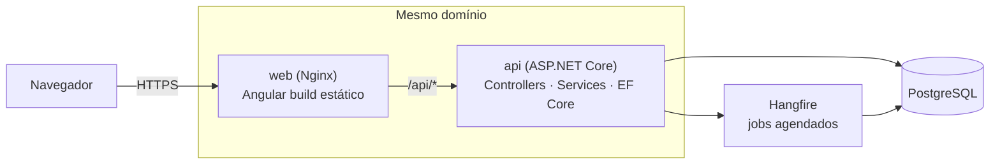

# TRD — Controle Financeiro Pessoal

> **Status:** Rascunho v1 · **Autor:** Marcus Vinicius Motta · **Data:** 2026-10-08
> **PRD de referência:** [docs/prd](../prd/README.md)

O PRD diz **o quê** e **por quê**; este TRD diz **como**. Cada decisão relevante está registrada como um **ADR** (*Architecture Decision Record*) em [`adr/`](adr/README.md), com contexto, alternativas e consequências.

## Visão geral da arquitetura

- O **Nginx** serve o Angular e repassa `/api/*` para a API. O navegador só enxerga uma origem, então não há CORS e o cookie do refresh token funciona sem configuração extra ([ADR-010](adr/010-mesmo-dominio-via-proxy.md)).
- A **API** é um monólito em camadas ([ADR-001](adr/001-arquitetura-em-camadas.md)) e roda também os jobs do **Hangfire** ([ADR-009](adr/009-hangfire.md)).
- O **PostgreSQL** guarda os dados da aplicação e as filas do Hangfire ([ADR-002](adr/002-postgresql.md)).

## Índice

### Documentos transversais
| Arquivo | Conteúdo |
|---------|----------|
| [01-arquitetura.md](01-arquitetura.md) | Camadas, dependências, fluxo de uma requisição, tratamento de erros |
| [02-modelo-de-dados.md](02-modelo-de-dados.md) | Diagrama ER, tabelas, tipos, constraints e índices |
| [03-api.md](03-api.md) | Convenções REST, formatos, paginação, erros e status HTTP |
| [04-seguranca.md](04-seguranca.md) | Autenticação, tokens, isolamento entre usuários, proteções |
| [05-frontend.md](05-frontend.md) | Estrutura Angular, estado, rotas, interceptors, formatação |
| [06-infra-e-deploy.md](06-infra-e-deploy.md) | Docker, ambiente local, configuração, CI/CD, deploy |
| [07-observabilidade.md](07-observabilidade.md) | Logs, correlation ID, health checks, painel do Hangfire |
| [08-testes.md](08-testes.md) | Estratégia, ferramentas e testes obrigatórios |

### Módulos (detalhamento técnico)
| Módulo | Fase | Arquivo |
|--------|------|---------|
| Autenticação | MVP | [modulos/01-autenticacao.md](modulos/01-autenticacao.md) |
| Contas | MVP | [modulos/02-contas.md](modulos/02-contas.md) |
| Categorias | MVP | [modulos/03-categorias.md](modulos/03-categorias.md) |
| Transações | MVP | [modulos/04-transacoes.md](modulos/04-transacoes.md) |
| Dashboard | MVP | [modulos/05-dashboard.md](modulos/05-dashboard.md) |
| Usuário demo | MVP | [modulos/06-usuario-demo.md](modulos/06-usuario-demo.md) |
| Importação, orçamento, recorrentes, exportação, Open Finance | 2 e 3 | [modulos/fases-2-e-3.md](modulos/fases-2-e-3.md) |

> Os módulos das Fases 2 e 3 têm apenas decisões preliminares. Eles serão detalhados quando a fase começar, seguindo a regra do PRD de não abrir uma fase antes de fechar a anterior.

## Resumo das decisões

| ADR | Decisão | Resolve |
|-----|---------|---------|
| [001](adr/001-arquitetura-em-camadas.md) | Monólito em 4 camadas, sem CQRS/MediatR | — |
| [002](adr/002-postgresql.md) | PostgreSQL | — |
| [003](adr/003-angular-material.md) | Angular Material como biblioteca de UI | T1 |
| [004](adr/004-identity-e-jwt.md) | ASP.NET Core Identity + JWT emitido pela própria API | T2 |
| [005](adr/005-armazenamento-de-tokens.md) | Access token em memória, refresh token em cookie `HttpOnly` | T3 |
| [006](adr/006-saldo-calculado.md) | Saldo da conta calculado na consulta | T4 |
| [007](adr/007-transferencia-dois-registros.md) | Transferência como dois registros vinculados | T5 |
| [008](adr/008-paginacao-e-exclusao.md) | Paginação por offset; exclusão física de transações | T6 |
| [009](adr/009-hangfire.md) | Hangfire para jobs agendados | T8, T9 |
| [010](adr/010-mesmo-dominio-via-proxy.md) | Frontend e API no mesmo domínio via Nginx | — |
| [011](adr/011-graficos-ng2-charts.md) | ng2-charts (Chart.js) para gráficos | T7 |
| [012](adr/012-dinheiro-e-datas.md) | `decimal`/`numeric(18,2)` para dinheiro; `DateOnly` para data de competência | — |

**Ainda em aberto:** T10 (dados temporários da importação), a ser decidido no início da Fase 2.
